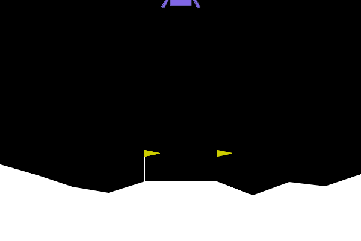

# DQN Lunar Lander

A Deep Q-Learning (DQN) agent trained to solve the LunarLander-v3 environment using PyTorch and OpenAI Gym. This project demonstrates reinforcement learning concepts such as experience replay, target networks, and epsilon-greedy exploration strategy.

---

## 🚀 Environment

- **Environment**: `LunarLander-v3` from OpenAI Gym
- **State Space**: 8 continuous variables
- **Action Space**: 4 discrete actions (do nothing, fire left engine, fire main engine, fire right engine)

---

## 🧠 Model Architecture

A simple fully connected feedforward neural network:

- `Input Layer`: 8 units (state size)
- `Hidden Layers`: 2 layers with 64 units each and ReLU activations
- `Output Layer`: 4 units (action values)

---

## 🛠️ Features

- Deep Q-Learning with target network updates
- Experience replay buffer
- Epsilon-greedy exploration with decay
- Training and loss monitoring
- Model checkpointing (`.pth` file)

---

## 📈 Training

The agent was trained for `1000` episodes with the following settings:

- Learning Rate: `0.001`
- Discount Factor (γ): `0.99`
- Replay Buffer Size: `10,000`
- Batch Size: `64`
- Epsilon Decay: `0.995` with `ε_min = 0.01`

### Plots for Training Rewards and Training Loss:

---
## 📊 Results Analysis

### 🎯 Training Rewards Plot Analysis

#### Learning Progression:

- **Initial Phase (0–200 episodes):**  
  Rewards range from -400 to 0, showing the agent is exploring and struggling with the environment in early learning stages.

- **Middle Phase (200–600 episodes):**  
  A steady upward trend appears as the agent begins to learn useful policies. Rewards improve from negative territory into consistent positive values.

- **Final Phase (600–1000 episodes):**  
  The agent stabilizes with rewards hovering around +200 to +300. The agent demonstrates a solid understanding of the environment dynamics.

- **Variance:**  
  Reward variance is high in early phases but reduces as the agent becomes more consistent. Some fluctuations continue, which is expected due to the stochastic nature of the environment.

#### Performance Indicators:

- Agent starts consistently achieving **positive rewards** after approximately **400 episodes**.
- Final performance averages around **+250**, indicating a strong ability to complete safe landings.
- Occasional dips even in later stages are typical in reinforcement learning and reflect exploratory moves or environmental randomness.

---

### 📉 Training Loss Plot Analysis

#### Loss Convergence:

- **Initial Spike:**  
  Loss starts high (~160) as the agent’s Q-values are poorly initialized and updates are large.

- **Rapid Decline:**  
  During the first 200 episodes, loss decreases rapidly as the agent gathers meaningful experience and begins generalizing.

- **Stabilization:**  
  After episode 400, loss values settle in the **15–20 range**, showing controlled learning updates and convergence.

#### Learning Stability:

- The training loss follows a **smooth downward trend**, signifying stable Q-learning updates.
- **No erratic spikes** are observed after the early phase, which implies the learning process is not suffering from instability or catastrophic forgetting.
- Consistently low loss values in later episodes confirm a well-trained Q-network with accurate Q-value estimations.

---

## Getting Started

Follow the steps below to set up and run the project on your local machine.

### Prerequisites

Make sure you have **Python 3.8+** installed. It's recommended to use a virtual environment.

You will also need to install the required dependencies:

pip install -r requirements.txt

Then run the python file:

python dqn_lunar_lander.py

## Acknowledgments

This project was developed as part of an academic assignment to demonstrate the implementation of Deep Q-Learning (DQN) using PyTorch.

Special thanks to:

- **OpenAI Gymnasium** for providing the LunarLander-v3 environment.
- **PyTorch** for the deep learning framework used in building and training the agent.
- Course instructors and peers for guidance and feedback throughout the project.
